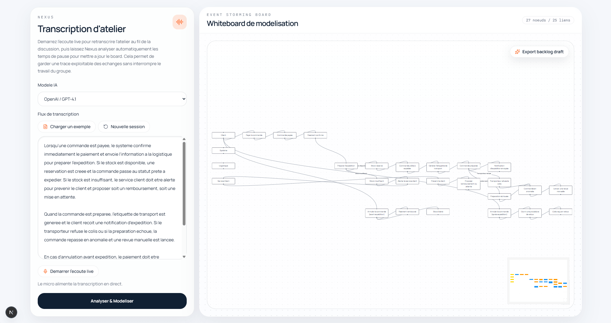
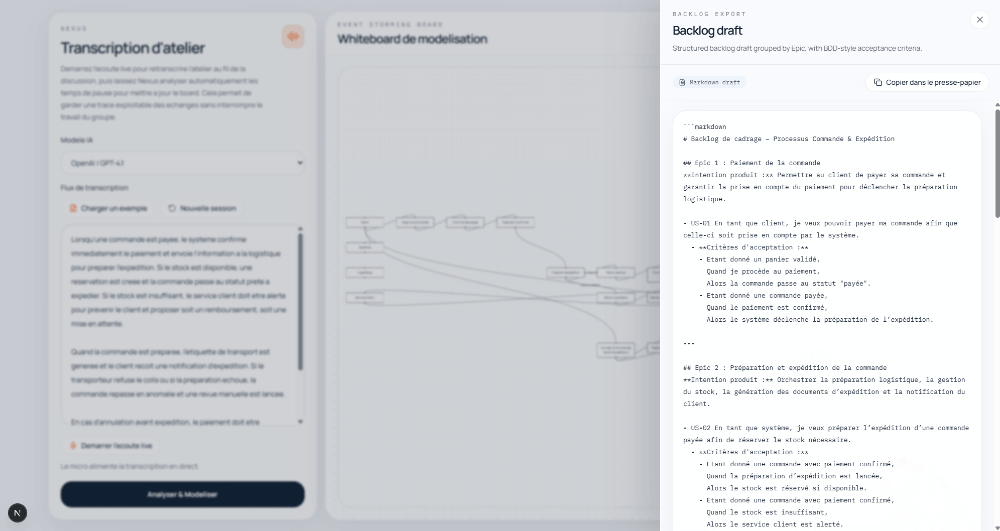

# Nexus




[FR](#francais) | [EN](#english)

## Francais

Nexus est un PoC concu pour capter le besoin client pendant un atelier et generer directement un board MVP exploitable.

Pendant l'atelier, Nexus ecoute la conversation. Au fur et a mesure que le client decrit son metier, par exemple :

> "Quand une commande est payee, on alerte la logistique, et si le stock est vide, on rembourse le client"

l'IA modelise la logique en temps reel sur un grand ecran.

Les participants voient leur processus mental se dessiner sous leurs yeux sous forme de flux Event Storming. Si une etape manque, le trou dans le diagramme devient visible immediatement. A la fin de la reunion, un bouton permet d'exporter un backlog de cadrage en Markdown, structure en Epics et User Stories, reutilisable dans Jira, Azure DevOps ou tout autre outil.

### Demarrage

Lancer le serveur de developpement :

```bash
npm run dev
```

Ouvrir [http://localhost:3000](http://localhost:3000) dans le navigateur.

### Configuration

Creer ou completer `C:\Sources\nexus-app\.env.local` :

```env
ANTHROPIC_API_KEY=
OPENAI_API_KEY=
GOOGLE_GENERATIVE_AI_API_KEY=
OLLAMA_API_KEY=
OLLAMA_BASE_URL=
```

Variables utiles :

- `ANTHROPIC_API_KEY` pour les modeles Anthropic
- `OPENAI_API_KEY` pour les modeles OpenAI
- `GOOGLE_GENERATIVE_AI_API_KEY` pour les modeles Gemini
- `OLLAMA_BASE_URL` pour pointer vers un serveur Ollama local ou distant
- `OLLAMA_API_KEY` est optionnelle si votre endpoint Ollama en demande une

Par defaut, Ollama utilise `http://127.0.0.1:11434/v1`.

Redemarrer ensuite le serveur Next.js.

### Parcours du PoC

1. Demarrer l'ecoute live depuis le panneau de gauche.
2. Choisir le modele LLM a utiliser parmi Anthropic, OpenAI, Gemini ou Ollama.
3. Laisser Nexus retranscrire la conversation dans la zone de texte.
4. Attendre une pause dans l'atelier : l'analyse se relance automatiquement pour mettre a jour le board.
5. Reorganiser les noeuds si besoin directement sur le whiteboard.
6. Cliquer sur `Export backlog draft` pour produire un backlog Markdown avec Epics, User Stories et criteres BDD.

### Stack

- Next.js App Router
- TypeScript
- Tailwind CSS
- React Flow (`@xyflow/react`)
- Vercel AI SDK
- Framer Motion

### Limites actuelles

- La transcription live repose sur la Web Speech API du navigateur.
- Le rendu courant cible un board Event Storming.
- Le choix du modele depend des cles configurees dans `.env.local`.
- L'export produit un backlog Markdown structure, pas une creation directe d'items via une API tierce.

### Suite possible

- Export Jira via API native
- Support BPMN en plus d'Event Storming
- Historique de versions du board
- Multi-participants et annotation collaborative

## English

Nexus is a PoC designed to capture client needs during a workshop and turn them directly into an actionable MVP board.

During the workshop, Nexus listens to the conversation. As the client describes the business flow, for example:

> "When an order is paid, we notify logistics, and if the stock is empty, we refund the customer"

the AI models the logic in real time on a shared screen.

Participants can see their mental process taking shape automatically as an Event Storming flow. If a step is missing, the gap in the diagram becomes obvious immediately. At the end of the meeting, a button exports a Markdown discovery backlog, structured into Epics and User Stories, that can be reused in Jira, Azure DevOps, or any similar tool.

### Getting started

Run the development server:

```bash
npm run dev
```

Open [http://localhost:3000](http://localhost:3000) in your browser.

### Configuration

Create or update `C:\Sources\nexus-app\.env.local`:

```env
ANTHROPIC_API_KEY=
OPENAI_API_KEY=
GOOGLE_GENERATIVE_AI_API_KEY=
OLLAMA_API_KEY=
OLLAMA_BASE_URL=
```

Useful variables:

- `ANTHROPIC_API_KEY` for Anthropic models
- `OPENAI_API_KEY` for OpenAI models
- `GOOGLE_GENERATIVE_AI_API_KEY` for Gemini models
- `OLLAMA_BASE_URL` to target a local or remote Ollama server
- `OLLAMA_API_KEY` is optional if your Ollama endpoint requires one

By default, Ollama uses `http://127.0.0.1:11434/v1`.

Then restart the Next.js server.

### PoC flow

1. Start live listening from the left panel.
2. Choose the LLM to use across Anthropic, OpenAI, Gemini, or Ollama.
3. Let Nexus transcribe the conversation into the text area.
4. Wait for a pause in the workshop: the analysis runs again automatically to refresh the board.
5. Reorganize nodes directly on the whiteboard if needed.
6. Click `Export backlog draft` to produce a Markdown backlog with Epics, User Stories, and BDD acceptance criteria.

### Stack

- Next.js App Router
- TypeScript
- Tailwind CSS
- React Flow (`@xyflow/react`)
- Vercel AI SDK
- Framer Motion

### Current limitations

- Live transcription relies on the browser Web Speech API.
- The current rendering targets an Event Storming board.
- Model selection depends on the provider keys configured in `.env.local`.
- The backlog export currently outputs structured Markdown, not direct ticket creation through a third-party API.

### Next steps

- Native Jira API export
- BPMN support in addition to Event Storming
- Board version history
- Multi-participant collaboration and annotation
